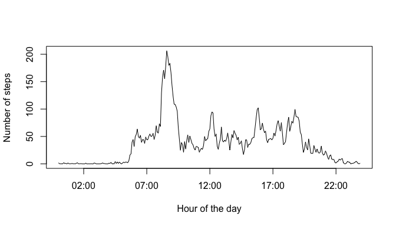

# Reproducible Research: Peer Assessment 1


## Loading and preprocessing the data


```r
workDir <- "/Users/arnon/Documents/Arnon/Data scientist/Reproducible Research/RepData_PeerAssessment1"
setwd(workDir)
zipFile <- file.path(workDir, "activity.zip")
if (!file.exists(zipFile)) {
    url <- "https://d396qusza40orc.cloudfront.net/repdata%2Fdata%2Factivity.zip"
    download.file(url, dest=workDir, method="curl")
}
if (!file.exists("activity.csv")) {
    unzip("activity.zip", exdir=workDir)
}
# Reads data
data <- read.csv("activity.csv", header=T)
# Here was a code to remove all the missing values, but I remarked it
# after seeing the "Imputing missing values" section
# data <- data[!is.na(data$steps),]
data$date <- as.POSIXct(data$date)
# data$interval <- as.character(data$interval)

library(stringr)
library(plyr)
# The variable "interval"" can serve as a variable of two types: factorial variable and time variable. As time variable it has a wierd format, basicly the time representation without the colon seperation. In order to get a correct representation of the time when generating graphs , one must convert it from integer/character to POSIXlt.
# Adds a new column showing "interval" as POSIXlt
data <- mutate(data, timeInterval=str_pad(data$interval, 4, pad = "0"))
data$timeInterval <- paste(substr(data$timeInterval,1,2),":",substr(data$timeInterval,3,4),sep="")
data$timeInterval <- as.POSIXct(strptime(data$timeInterval,"%R"))
data <- mutate(data, intervalIndx=rep(1:288,61))
```

## What is mean total number of steps taken per day?


```r
# Calculates the sum of the steps per day with "aggregate"
stepsByDaySum <- aggregate(steps ~ date, data=data, sum)
# Plots a histogram showing the distribution of the "total number of steps per day""
hist(stepsByDaySum$steps, main="Distribution of total steps per day", xlab="Number of steps", ylab="Frequency (days)",col="dark grey", breaks=8)
```

 

Thus, the mean and median of the total number of steps per day is:

```r
s1 <- summary(stepsByDaySum$steps)
s1[3:4]
```

```
## Median   Mean 
##  10760  10770
```

## What is the average daily activity pattern?


```r
intStepsMean <- with(data, tapply(steps, interval, mean, na.rm=TRUE))
uTimeInterval <- unique(data$timeInterval)
uInterval <- unique(data$interval)

plot(uTimeInterval, intStepsMean, type="l", xlab="Hour of the day", ylab="Number of steps")
```

 

 

```r
n <- max(intStepsMean)
indx <- which.max(intStepsMean)
# Prints the hour in the day that shows, on average across all days, the highst activity level
sprintf("At %s (the %g-th interval), on average across all the days in the dataset, we observe the highest activity in terms of the number of steps taken", strftime(uTimeInterval[indx], format="%H:%M"), indx)
```

```
## [1] "At 08:35 (the 104-th interval), on average across all the days in the dataset, we observe the highest activity in terms of the number of steps taken"
```

## Imputing missing values

The number of rows in the dataset without missing values is:

```r
notNA <-complete.cases(data)
sum(notNA)
```

```
## [1] 15264
```
To make the dataset complete I advise filling each missing data with the mean number of steps for that 5-minute interval


```r
# Fills up missing values based on the above mentioned starategy 
for (i in uInterval) {
    data[(data[,3]==i & !notNA),1] <- intStepsMean[uInterval==i]
}
### Generates histogram for the total number of steps taken every day ###

# Calculates the sum of the steps per day with "aggregate"
stepsByDaySum <- aggregate(steps ~ date, data=data, sum)
# Plots a histogram showing the distribution of the "total number of steps per day""
hist(stepsByDaySum$steps, main="Distribution of total steps per day", xlab="Number of steps", ylab="Frequency (days)",col="blue", breaks=8)
```

 

```r
s2 <- summary(stepsByDaySum$steps)
s2[3:4]
```

```
## Median   Mean 
##  10770  10770
```

There is no effect on the the calculated mean 'steps per day' by filling up the missing values using the chosen strategy. The means are the same.

## Are there differences in activity patterns between weekdays and weekends?


```r
# Loads needed libraries
library(ggplot2)
data <- mutate(data, dayType=(weekdays(date)=="Saturday" | weekdays(date)=="Sunday"))
data$dayType <- factor(data$dayType, c(F,T), labels=c("weekday", "weekend"))

# Averages the number of steps over two factors: 5-min interval and dayType(weekday Vs. weekend)
aggDataMean <- aggregate(steps ~ intervalIndx + dayType, data=data, mean)
# Plots the two graphs one on top of the other for easy comparison
qplot(intervalIndx, steps, data=aggDataMean, geom="line", xlab="Interval index (of 5min)", ylab="Mean steps") + facet_grid(dayType ~ .)
```

 
